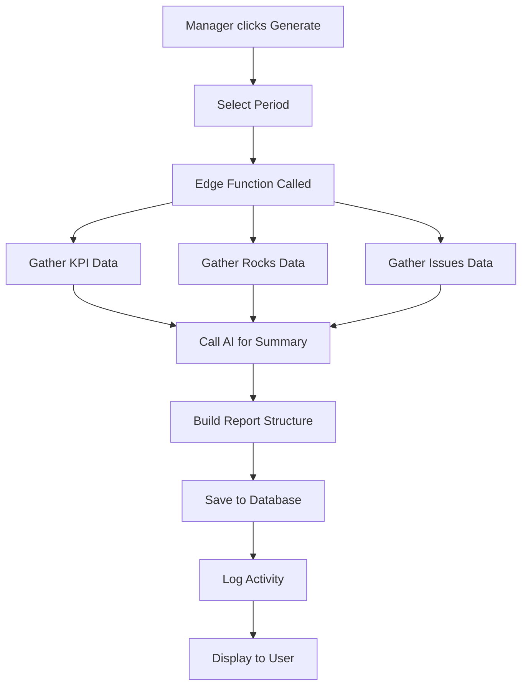

# AI-Generated Reporting System - Implementation Guide

## Overview
Professional weekly and monthly EOS summary reports with AI-curated insights, PDF export capability, and email delivery system.

## ✅ Features Implemented

### 1. **Report Generation**
- ✅ Weekly and monthly report periods
- ✅ AI-powered executive summaries
- ✅ Comprehensive KPI, Rocks, and Issues analysis
- ✅ Integration with existing AI insights
- ✅ Automatic data aggregation from multiple sources

### 2. **Database Structure**
```sql
reports(
  id uuid,
  team_id uuid,
  period enum('weekly', 'monthly'),
  week_start date,
  summary jsonb,
  file_url text,
  sent_at timestamptz,
  created_at timestamptz
)
```

### 3. **Report Content Sections**
Each report includes:
- **Executive Summary**: 3 key bullet points for leadership
- **AI Commentary**: Professional, encouraging summary
- **Wins**: 3 specific achievements
- **Challenges**: 3 key obstacles
- **Opportunities**: 3 actionable next steps
- **KPI Scorecard**: All active KPIs with trends
- **Rocks Summary**: Status breakdown
- **Issues Summary**: New, solved, and open counts

### 4. **User Interface**

#### Reports Page (`/reports`)
- Grid view of all reports
- Filter by period (weekly/monthly)
- Generate new reports (managers only)
- Status badges (sent/unsent)
- Quick metrics preview

#### Report Viewer (`/reports/:id`)
- Full report display
- Professional layout
- Downloadable PDF (when available)
- Color-coded sections
- Mobile responsive

#### Report Cards
- Cover preview with key metrics
- Executive summary snippet
- Quick actions (view, download)
- Period badge
- Sent status indicator

### 5. **Permissions & RLS**
| Role | View Current Week | View Archive | Generate Reports |
|------|-------------------|--------------|------------------|
| Staff | ✅ | ❌ | ❌ |
| Manager | ✅ | ✅ | ✅ |
| Director | ✅ | ✅ | ✅ |
| Owner | ✅ | ✅ | ✅ |

### 6. **AI Integration**
The report generation uses:
- Latest AI insights from `ai_insights` table
- KPI data with trend analysis
- Rocks status tracking
- Issues resolution metrics
- Professional tone with encouraging language

## 🔧 Technical Implementation

### Edge Function: `generate-report`
**Purpose**: Generate comprehensive EOS reports with AI analysis

**Input**:
```typescript
{
  team_id: string,
  period: "weekly" | "monthly"
}
```

**Process**:
1. Calculate date range based on period
2. Gather KPI readings
3. Collect Rocks data
4. Aggregate Issues
5. Fetch latest AI insights
6. Generate AI summary via Lovable AI
7. Build structured report summary
8. Store in database
9. Log usage and activity

**Output**:
```typescript
{
  success: boolean,
  report: Report
}
```

### Report Summary Structure
```typescript
{
  period_label: string,
  executive_summary: string[],
  wins: string[],
  challenges: string[],
  opportunities: string[],
  kpi_summary: KpiSummaryItem[],
  rocks_summary: {
    total: number,
    on_track: number,
    at_risk: number,
    completed: number
  },
  issues_summary: {
    opened: number,
    solved: number,
    open: number
  },
  forecast: [], // Placeholder
  ai_commentary: string
}
```

## 📊 Usage Tracking

All report generation is tracked:
- Tokens consumed
- API calls made
- Cost estimates
- Generation timestamp
- Team/period context

## 🎨 Design System

### Color Coding
- **Wins**: Success green with 🚀 emoji
- **Challenges**: Warning yellow with ⚠️ emoji
- **Opportunities**: Brand color with 💡 emoji
- **AI Commentary**: Brand gradient background

### Card Styling
- Clean white cards
- Subtle borders
- Hover effects
- Consistent spacing
- Responsive layout

## 🚀 Getting Started

### For Managers
1. Navigate to `/reports`
2. Click "Generate Report"
3. Select period (weekly/monthly)
4. Click "Generate"
5. View created report in grid

### For Staff
1. Navigate to `/reports`
2. View current week's report
3. Click to open detailed view
4. Review key metrics and summaries

## 📋 Report Generation Workflow



## 🔮 Future Enhancements

### Phase 2 - PDF Export
- [ ] PDF generation with branded template
- [ ] Store in Supabase Storage
- [ ] Link to download from reports page
- [ ] Email attachment support

### Phase 3 - Email Delivery
- [ ] Integration with Resend
- [ ] HTML email templates
- [ ] Scheduled delivery (Sunday 11 PM)
- [ ] Distribution list management
- [ ] Delivery tracking

### Phase 4 - Advanced Features
- [ ] Forecast section with predictions
- [ ] Benchmark comparisons (multi-clinic)
- [ ] Custom report sections
- [ ] Report templates
- [ ] Scheduled recurring reports

## 📈 Metrics to Monitor

| Metric | Target | Location |
|--------|--------|----------|
| Reports Generated/Week | 1-2 | Reports Page |
| AI Token Usage | < 10k/report | AI Settings |
| Generation Time | < 30 sec | Console Logs |
| User Engagement | > 80% views | Analytics |

## 🛠️ Troubleshooting

### Common Issues

**Report not generating**
- Check user permissions (manager+)
- Verify team_id is set
- Check edge function logs
- Ensure AI credits available

**Empty data sections**
- Verify KPIs have recent readings
- Check Rocks exist for period
- Ensure Issues are tracked
- Validate date range calculation

**Slow generation**
- Normal for first run (cache warming)
- Large datasets take longer
- AI API latency varies
- Consider background generation

## 🔐 Security Notes

- All reports scoped by `team_id`
- RLS policies prevent cross-team access
- Staff limited to current week only
- Managers see full team history
- No sensitive patient data in AI prompts

## 📝 Best Practices

### For Managers
1. Generate reports weekly on Monday mornings
2. Review AI commentary for accuracy
3. Share with leadership via email
4. Archive important reports
5. Use for quarterly reviews

### For Administrators
1. Monitor AI token usage
2. Review report quality regularly
3. Adjust prompts if needed
4. Track user engagement
5. Maintain data quality

## 🎯 Key Benefits

1. **Time Savings**: Automated report generation vs manual compilation
2. **Consistency**: Same format and structure every time
3. **AI Insights**: Professional summaries with encouraging tone
4. **Data Integration**: All EOS components in one view
5. **Accessibility**: Easy viewing and sharing
6. **Historical Record**: Archive of past performance

## 📚 Technical Details

### Dependencies
- Lovable AI (google/gemini-2.5-flash)
- React Query for data fetching
- Supabase for storage
- TypeScript for type safety

### File Structure
```
src/
├── types/reports.ts           # TypeScript definitions
├── pages/
│   ├── Reports.tsx           # Main reports list
│   └── ReportView.tsx        # Individual report viewer
├── components/
│   └── reports/
│       └── ReportCard.tsx    # Report preview card
supabase/
└── functions/
    └── generate-report/
        └── index.ts          # Report generation logic
```

### Database Indexes
- `idx_reports_team_period`: Fast filtering by team and period
- `idx_reports_created`: Quick sorting by date

### RLS Implementation
```sql
-- Managers can manage team reports
CREATE POLICY "Managers can manage team reports"
  ON reports FOR ALL
  USING (is_manager() AND is_same_team(team_id))
  WITH CHECK (is_manager() AND is_same_team(team_id));

-- Staff can only read current week
CREATE POLICY "Staff can read current week report"
  ON reports FOR SELECT
  USING (
    is_same_team(team_id) AND
    week_start >= (CURRENT_DATE - INTERVAL '7 days')::date
  );
```

## 🌟 Success Metrics

After implementation, track:
- ✅ Number of reports generated per week
- ✅ User engagement (views per report)
- ✅ Time saved vs manual reporting
- ✅ Leadership satisfaction with format
- ✅ Accuracy of AI summaries

## 🎓 Training Materials

### Quick Start Video Script
1. "Welcome to the Reports feature"
2. "Click Reports in the sidebar"
3. "Managers can generate new reports"
4. "Select weekly or monthly"
5. "View detailed report breakdowns"
6. "Download PDFs when available"

### FAQ

**Q: How often should I generate reports?**
A: Weekly reports on Mondays, monthly at month end

**Q: Can I edit report content?**
A: No, reports are AI-generated and immutable for accuracy

**Q: Who receives report emails?**
A: Configure distribution list in Settings (future feature)

**Q: How far back can I view reports?**
A: Managers see all history, staff see current week only

**Q: What if data is missing?**
A: Report shows what's available, flags missing sections

## 🔄 Maintenance

### Weekly Tasks
- Review new reports for quality
- Check AI token usage
- Monitor generation times
- Address user feedback

### Monthly Tasks
- Audit report accuracy
- Update AI prompts if needed
- Review usage metrics
- Plan enhancements

### Quarterly Tasks
- Analyze trends in reporting
- Survey user satisfaction
- Evaluate feature additions
- Optimize performance

---

**Note**: This is Phase 1 implementation. PDF export and email delivery are ready for Phase 2 development.
